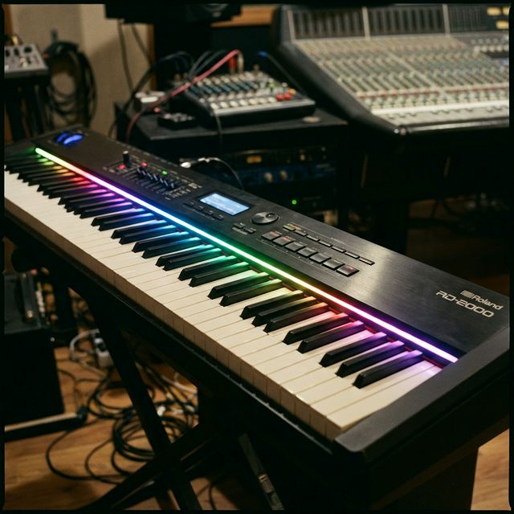

# Piano LED Visualizer 🎹✨

電子ピアノの鍵盤が押された際に、その真上のLEDが光るシステムを構築するプロジェクトです。
本プロジェクトは、[onlaj/Piano-LED-Visualizer](https://github.com/onlaj/Piano-LED-Visualizer) の構成に準拠して制作を進めています。

## ディレクトリ構造

- `/docs`: 要件定義、設計書、配線図
- `/firmware`: マイコン（Arduino等）用ソースコード
- `/hardware`: 部品表 (BOM)、回路図
- `/models`: 3Dプリンター用モデルデータ
- `/external`: [onlaj/Piano-LED-Visualizer](https://github.com/onlaj/Piano-LED-Visualizer) の日本語訳済サブモジュール

## サブモジュールの利用

本プロジェクトでは、オリジナルのリポジトリを [mono0926/Piano-LED-Visualizerにフォークし、`ja` ブランチ](https://github.com/mono0926/Piano-LED-Visualizer/tree/ja)で日本語訳を管理しています。

最新のオリジナルドキュメント（日本語訳）は `/external/README.md` を参照してください。

### 更新ワークフロー

オリジナルの更新を取り込む場合は、以下の手順で行います：

1. `external` ディレクトリで `upstream` (onlaj版) から `main` にプル
2. `ja` ブランチに切り替え、`main` をマージまたはリベース
3. 日本語訳を適宜更新してプッシュ

---

## 🛠 本プロジェクト独自のアレンジ・改善点

本プロジェクトは `onlaj/Piano-LED-Visualizer` をベースとしながらも、日本国内におけるパーツ入手性や、安定動作・長寿命化を目的として以下の**独自アレンジ（推奨構成）** を採用しています。ドキュメント内でも「独自アレンジ」として都度明記しています。

1. **「横並び（案B）」基板レイアウトの採用**
   - オリジナルはラズパイ上にディスプレイを重ねる「スタッキング（案A）」ですが、本作例では熱対策を最優先し、大型基板に平面的に配置する方式を標準としています。それに伴い、ケースも独自の3Dプリントモデルを推奨しています。
2. **Power Injection（電力注入）のアップグレード案**
   - オリジナル同様にソフトウェア側で最大輝度を制限（50%程度）して運用するのが基本ですが、ハードウェア側で両端等から電力注入を行うことで、144LED/mの高密度テープでも100%の明るさで安定動作させる独自のアップグレード手法（オプション）もガイドに残しています。
3. **安全システムの組み込み**
   - オリジナルには明記されていない、火災防止用の「ヒューズ」と電圧安定用の「大容量コンデンサ（1000μF）」の組み込み手順を追加しています。
4. **ハイブリッドLEDレールの自作**
   - 単にLEDテープを貼るだけでなく、放熱と美観を兼ね揃えた「アルミフラットバー＋シリコンチューブ」の独自パーツ構成を提案しています。

---

## 🏁 はじめかた

プロジェクトを開始するための手厚いガイドを用意しました。部品が届く前の準備から、完成後の調整までをカバーしています。

- [**ビギナーズ・スタートガイド**](docs/getting_started_guide.md) 👈 まずはこちら！

### ドキュメント全集

- [**ドキュメント・インデックス (Document Map)**](docs/index.md)
  - すべてのハードウェア・ソフトウェアのガイドや設計資料を一覧できます。作業中に行き詰まったり、より詳しい情報が必要な場合はこちらをご参照ください。

---

## 現在のステータス

- プロジェクト初期構築中
- 要件定義（MIDI連動、WS2812B使用）の整理完了
- オリジナルドキュメントのサブモジュール化と日本語化（`ja` ブランチ）完了
- 初心者向けスタートガイド作成完了
