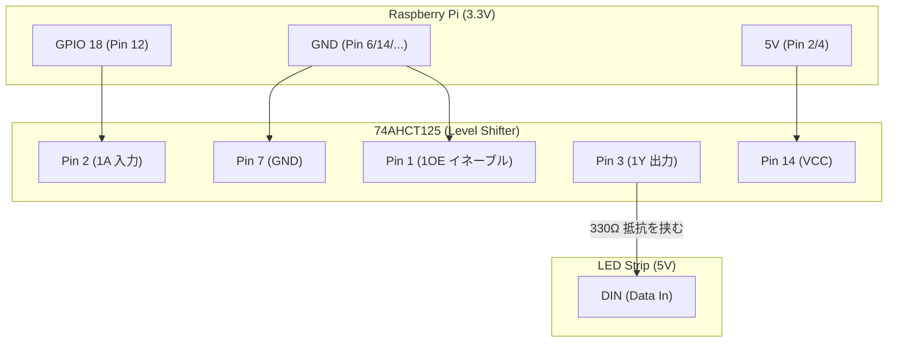

# フェーズ 2.2: コントローラー（ラズパイ・レベルシフタ）の配線 🧠⚡️

このフェーズでは、Raspberry Pi からの信号をLEDテープが理解できる電圧（5V）に変換し、ディスプレイとともに組み立てる工程を解説します。

---

## 🛠 準備するもの

- [ ] **Raspberry Pi Zero 2 WH** (ピンヘッダ実装済み)
- [ ] **SN74AHCT125N** (レベルシフタ IC)
- [ ] **Waveshare 1.44" LCD HAT**
- [ ] **ユニバーサル基板 (大)** (例: 秋月 100518 95×72mm)
- [ ] **ピンヘッダ 1×40** (適宜カット) または連結ピンソケット
- [ ] **ICソケット 14P** (ICの保護用)
- [ ] **330Ω 抵抗**
- [ ] **ジャンパー線 / シリコンワイヤー (24AWG)**

---

## 1. なぜレベルシフタが必要なのか？

Raspberry Pi の信号（GPIO）は **3.3V** で出力されます。しかし、WS2812B LEDテープは **5V** の信号を期待しています。
3.3Vでも「たまたま動く」ことはありますが、動作が不安定になったり、LEDが勝手に点滅したりする原因になります。**SN74AHCT125** を使うことで、3.3Vをクリーンな5Vへと「翻訳」し、安定した制御を実現します。

---

## 2. 信号変換回路の作成

ICを直接基板に立てるのではなく、**ICソケット**を使うことを強く推奨します。

### 📌 SN74AHCT125 ピン配置と接続先

### 🔨 組み立ての手順

1. **ICソケットの配置**: ユニバーサル基板の中央付近にICソケットを配置します。
2. **電源供給**:
   - ICの **Pin 14** をラズパイの **5V** ピンへ接続。
   - ICの **Pin 7** をラズパイの **GND** ピンへ接続。
3. **信号入力**: ラズパイの **GPIO 18 (Pin 12)** を ICの **Pin 2 (1A)** へ接続。
4. **イネーブル設定**: ICの **Pin 1 (1OE)** を **GND** に落とします。 これをしないと出力が有効になりません。
5. **出力（信号の出口）**: ICの **Pin 3 (1Y)** から **330Ωの抵抗** を介して、LEDテープのコネクタ（`DIN`）へ繋ぎます。
   - _※ 330Ωの抵抗は、信号の反射を防ぎ、LEDの最初のチップを電気的な衝撃から守る「保護装置」として機能します。_

---

## 3. ディスプレイ (LCD HAT) の装着とレイアウト

ステータス（IPアドレスやCPU使用率）を表示するために Waveshare 1.44" LCD HAT を使います。
高負荷になる本プロジェクトにおいて熱暴走を防ぐため、**「横並び（案B）」のレイアウトを強く推奨**します。

> [!NOTE]
> **独自アレンジについて**
> ベースプロジェクト（`onlaj`版）では極小サイズを目指しラズパイの上に基板を重ねる「三層構造」が基本ですが、本プロジェクトでは熱対策とメンテナンス性を高めるため、大型基板の上で平面的に配置する「横並び構成」を独自に推奨しています。

### 🥪 横並び配置（推奨）のコツ

大型のユニバーサル基板（90×70mm程度）を使用し、Raspberry Pi と LCD を平面的に並べます。

1. **Pi Zero の固定**: 基板の端にピンヘッダ（または連結ピンソケット）を立てて Pi Zero を固定します。
2. **LCD の固定**: Pi に被さらない位置に LCD HAT を並べて配置し、ピンヘッダで固定します。
3. **部品の配置**: 空いたスペースにレベルシフター（ICソケット）、抵抗、コンデンサなどを配置します。
4. **配線**: 裏面でそれぞれのピン（5V, GND, GPIO等）をジャンパワイヤやスズメッキ線で繋ぎます。

> [!TIP]
> **なぜスタッキング（重ね合わせ）を避けるのか？**
> Pi Zero の上に直接レベルシフタ基板と LCD を重ねる「三層構造」はコンパクトですが、Pi の熱がこもりやすく、配線も非常に窮屈になります。横並びにすることで、大型ヒートシンクが装着可能になり、デバッグも容易になります。
> （※極限までコンパクトにしたい場合のみ、公式のスタッキング構成を採用してください。詳細は [assembly_options.md](../hardware/assembly_options.md) 参照）

---

## 4. 総点検（テスターがある場合）

電源を入れる前に、テスターの「導通モード」で以下の点を確認してください。

- [ ] 5V と GND が繋がっていないか（ショートしていないか）。
- [ ] GPIO 18 から IC の Pin 2 まで電気が通っているか。
- [ ] IC の Pin 1 が確実に GND に落ちているか。

---

## 🏁 完了チェックリスト

- [ ] レベルシフタ IC の向き（欠けがある方が上）が正しい。
- [ ] 330Ω の抵抗が信号線に割り込んでいる。
- [ ] Pi と LCD が干渉せず、しっかり固定されている。

次は、ACアダプタと安全のための保護回路の作成に進みます。

[**フェーズ 2.3: 電源システムと安全回路**](hw_step2_3_power_safety.md) へ進む ➡️
