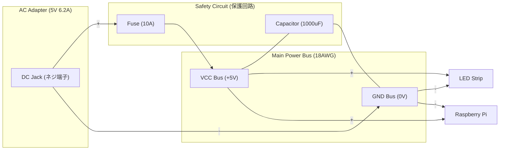

# フェーズ 2.3: 電源システムと安全回路 🔌🛡️

このフェーズでは、システム全体の生命線である「電力」を安全かつ安定して供給するための回路を構築します。LEDテープは大電流を消費するため、安全対策が最も重要です。

> [!NOTE]
> **独自アレンジについて**
> オリジナルプロジェクトでは詳細な電源保護回路の指定はありませんが、本プロジェクトでは安全最優先のため、ヒューズ（火災防止）と大容量コンデンサ（動作安定化）の組み込みを**必須の独自プロセス**として追加しています。

---

## 🛠 準備するもの

- [ ] **ACアダプター 5V 6.2A**
- [ ] **DCジャック (メタル) スクリュー端子台**
- [ ] **ヒューズ (10A)** & **ヒューズホルダ**
- [ ] **電解コンデンサ (1000μF 10V)**
- [ ] **シリコンワイヤー (18AWG)** : 電源ライン用
- [ ] **シリコンワイヤー (24AWG)** : 信号・分岐用

---

## 1. 電源系統の全体像

LEDテープ（最大144個/m × 2m ≒ 288個）をフルパワーで点灯させると、理論上は数アンペアの電流が流れます。これを細い線で繋ぐと発熱し、最悪の場合は発火します。

### 📊 電源ライン配線図

---

## 2. 安全のための二大要素

### ① ヒューズ (火災防止の最後の砦)

ACアダプタから出た直後の **+5V ライン**に 10A のヒューズを直列に入れます。

- **なぜ必要か？**: 万が一、配線のどこかでショート（+と-が直接触れる）が起きた際、ヒューズが身代わりになって切れることで、ACアダプタの破裂や配線の発火を防ぎます。
- **取り付け**: 中継用ヒューズホルダを使い、しっかり固定してください。

### ② 電解コンデンサ (電圧のダム)

5V と GND の間に 1000μF の電解コンデンサを並列に入れます。

- **なぜ必要か？**: LEDが急激に点灯・消灯を繰り返すと、電圧が激しく変動します。コンデンサは電気を一次的に蓄える「ダム」として働き、電圧の落ち込みを防いでRaspberry Pi のフリーズを防止します。
- **注意**: 電解コンデンサには**極性（向き）**があります。
  - **長い足 / 模様がない方**: +5V へ
  - **短い足 / 白い帯がある方**: GND へ

---

## 3. GNDの共通化 (Common Ground)

電子工作で最も多い失敗の一つが「GNDの浮き」です。

> [!IMPORTANT]
> **全てのGNDは一箇所に集める**
>
> 1. ACアダプタのGND
> 2. LEDテープのGND
> 3. Raspberry Pi のGND
>
> これら全てを、一つの太い線（GNDバス）でしっかりと繋いでください。これができていないと、信号の基準電圧がバラバラになり、LEDが激しくノイズを拾います。

---

## 4. ワイヤーの使い分け

購入したシリコンワイヤーを適切に使い分けます。

- **18AWG (太い線)**:
  - DCジャック 〜 LEDテープ間
  - DCジャック 〜 Raspberry Pi間
  - _大電流が流れるメイン通りに使用します。_
- **24AWG (細い線)**:
  - 信号線 (GPIO 18 〜 レベルシフタ 〜 LED $DIN$)
  - LCD HAT への給電など
  - _小電流の信号や分岐に使用します。_

---

## 🏁 完了チェックリスト

- [ ] ヒューズが「+5V」側のラインに入っている。
- [ ] 電解コンデンサの向き（+と-）が正しい。
- [ ] ラズパイのGNDとLEDのGNDが共通のラインに繋がっている。
- [ ] 電源ケーブル（18AWG）を左右に引っ張っても簡単に抜けない。

いよいよ最終段階、これらをピアノに組み込んで完成させます。

[**フェーズ 2.4: ピアノへの取り付けと最終接続**](hw_step2_4_final_assembly.md) へ進む ➡️
