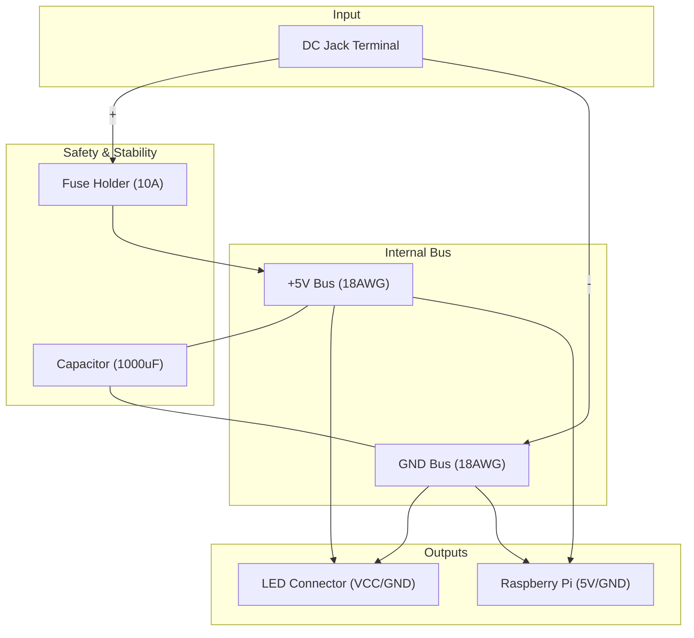

# 電源系統 配線詳細ガイド 🔌🔧

このガイドでは、フェーズ 2.3 の実作業における具体的な配線手順とはんだ付けのポイントを解説します。

## 1. 全体配線図 (Physical Layout)

コントローラー基板上、または中継部分での接続イメージです。

## 2. 実作業のステップ

### Step 1: DCジャック電源ラインの作成
1. **18AWG (太い線)** の赤と黒を準備します。
2. DCジャックのネジ端子にしっかり差し込み、締め込みます。
   - **赤**: `+` (正極)
   - **黒**: `-` (負極/GND)

### Step 2: ヒューズホルダの取り付け
1. **赤色(VCC)** のラインを途中でカットし、ヒューズホルダを直列に割り込ませます。
2. はんだ付け後、必ず **熱収縮チューブ** で絶縁してください。

### Step 3: コンデンサの取り付け
1. VCC（ヒューズの後）と GND の間に電解コンデンサを配置します。
2. **重要: 極性確認**
   - **長い足**: VCC (+)
   - **短い足 / 白い帯面**: GND (-)
   - 足が露出するので、ここも熱収縮チューブや絶縁テープで保護します。

### Step 4: 各デバイスへの分岐
1. VCCバスとGNDバスから、Raspberry Pi（5V/GNDピン）とLEDテープ用コネクタへ分岐させます。

## 3. 🛡️ 安全・安定のためのヒント

### はんだ付けのコツ
- **18AWGは熱が逃げやすい**: はんだごての温度を少し高め（350℃〜370℃）に設定し、予熱をしっかりしてから流し込んでください。
- **イモはんだ注意**: 表面がキラッとして、線にしっかりなじんでいるか確認してください。

### 絶縁の徹底
- 電源ラインは剥き出しの部分がないようにします。ショートはACアダプタの保護回路が働くか、最悪の場合発火の原因になります。

### テスターによる最終確認
- **電源を入れる前**: VCCとGNDの間の抵抗を測り、0Ω（ショート）になっていないことを確認。
- **電源を入れた直後**: 5Vが正しく各部に来ているか電圧を確認。
