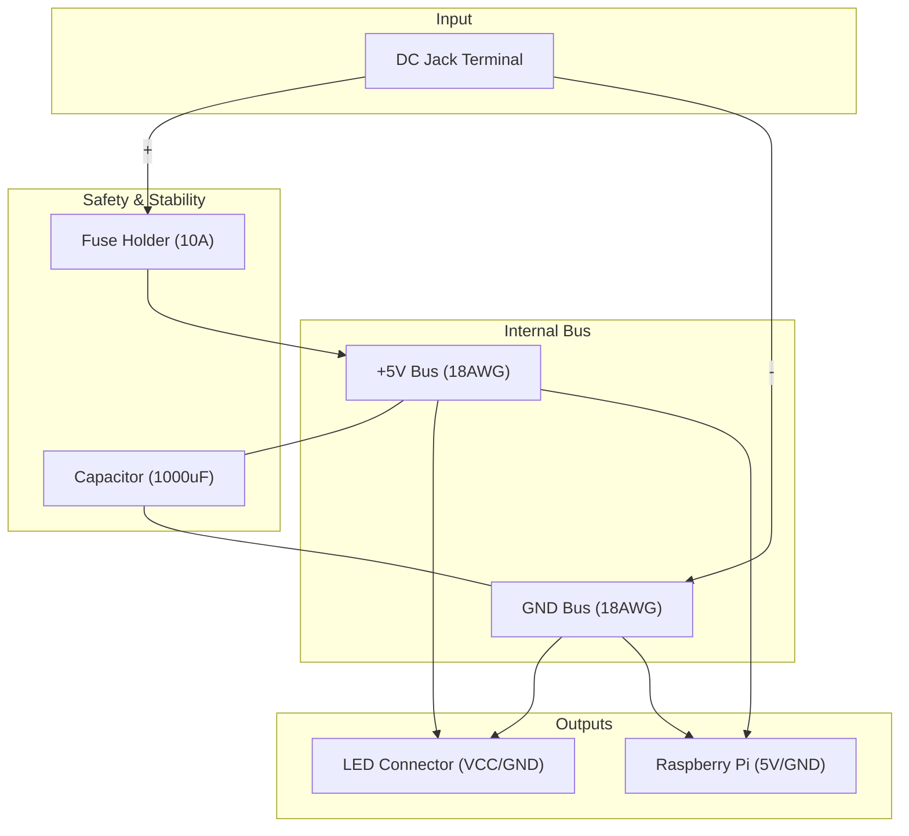

# 電源系統 配線詳細ガイド 🔌🔧

このガイドでは、フェーズ 2.3 の実作業における具体的な配線手順とはんだ付けのポイントを解説します。

## 1. 全体配線図 (Physical Layout)

コントローラー基板上、または中継部分での接続イメージです。



## 2. 実作業のステップ

### Step 1: DCジャック電源ラインの作成
1. **18AWG (太い線)** の赤と黒を準備します。
   - **GNDの共通化 (Common Ground)**: 全てのGND（ACアダプタ、LED、Pi）を1点に集約します。
   - **基板レイアウト**: Raspberry Pi と電源回路（ヒューズ・コンデンサ）を同じユニバーサル基板に載せる場合、基板内の「左半分は電源系」「右半分はマイコン系」のようにエリアを分けるのがコツです。
   - **推奨長**: **各20cm程度**（ケース内のレイアウトに余裕を持たせるため。後でカットして調整します）
2. DCジャックのネジ端子にしっかり差し込み、締め込みます。
   - **赤**: `+` (正極)
   - **黒**: `-` (負極/GND)

### Step 2: ヒューズホルダの取り付け
1. 先ほど準備した **赤色(VCC)** 20cm のうち1本を、DCジャック側から **7cm** の位置でカットします（残りは 13cm になります）。
2. その切断面の間にヒューズホルダを直列に割り込ませ、はんだ付けします。
   - **理由**: なるべく電源の入り口（DCジャック）に近いところで保護するため。
3. **絶縁と収納**: ケース自体が絶縁の役割を果たすため、追加の熱収縮チューブは不要です。金具をケースにパチンとはめて閉じれば完了です。

### Step 3: コンデンサの取り付け
1. VCC（ヒューズの後）と GND の間に電解コンデンサを配置します。
2. **重要: 極性確認**
   - **長い足**: VCC (+)
   - **短い足 / 白い帯面**: GND (-)
   - 足が露出するので、ここも熱収縮チューブや絶縁テープで保護します。

### 📍 パワーハブの詳細配置マップ (基板右下コーナー)

基板の穴を縦横の座標に見立てた配置例です。一番下の1〜2行を「線路」のように横に長く使うのがコツです。

```text
(基板表面から見た図)
-----------------------------------------------
  [空きスペース]
-----------------------------------------------
  [VCCバス列 (+)] : (赤色の線路)
    ● --- ● --- ● --- ● --- ●
    (Input) (Cap+) (To Pi) (To LED) (予備)
-----------------------------------------------
  [GNDバス列 (-)] : (黒色の線路)
    ■ --- ■ --- ■ --- ■ --- ■
    (Input) (Cap-) (To Pi) (To LED) (予備)
-----------------------------------------------
  最下段の縁
```

1. **下から1行目を「GNDバス（黒）」、2行目を「VCCバス（赤）」にする**:
   - 18AWGの切れ端や、たっぷりの「はんだ盛り」で、横一列の穴を全て繋いで「レール」を作ります。
2. **左から順に接続していく**:
   - 一番右：DCジャックからの入力（18AWGを分割挿入）
   - その隣：電解コンデンサ（長い足を2行目のVCCへ、短い足を1行目のGNDへ）
   - さらに隣：Raspberry Piへの分岐
   - さらに隣：LEDテープへの分岐
3. **視認性の確保**:
   - 全ての「赤」を2行目に、「黒」を1行目に集約させることで、パッと見て「どこがプラスでどこがマイナスか」が分かるようになり、ミスが激減します。

### Step 4: 各デバイスへの分岐
1. VCCバスとGNDバスから、Raspberry Pi（5V/GNDピン）とLEDテープ用コネクタへ分岐させます。

## 3. 🛡️ 安全・安定のためのヒント

### はんだ付けのコツ
- **18AWGは熱が逃げやすい**: はんだごての温度を少し高め（350℃〜370℃）に設定し、予熱をしっかりしてから流し込んでください。
- **太い線の基板接続 (18AWGがつかえる場合)**:
  - **分割挿入法**: 芯線を2つ（または3つ）の束に分け、隣り合う複数の穴に差し込んでから裏側でまとめてはんだ付けします。これが最も頑丈です。
  - **ピンヘッダ流用法 (複数ピン並列)**:
    - ピンヘッダのピン1本は通常3A程度が限界です。6A流す場合は、3〜4本分をまとめて使い、裏側ではんだを盛って全て連結します。18AWGをその上の「複数のピン」にまたがるようにはんだ付けすれば、基板に刺さるようになります。
  - **表面はんだ**: 基板の穴に通さず、2〜3個のランド（はんだ付け用の輪っか）をあらかじめはんだで繋いでおき、その上に線を横たえて直接はんだ付けします。
- **イモはんだ注意**: 表面がキラッとして、線にしっかりなじんでいるか確認してください。

### 絶縁の徹底
- 電源ラインは剥き出しの部分がないようにします。ショートはACアダプタの保護回路が働くか、最悪の場合発火の原因になります。

### テスターによる最終確認
- **電源を入れる前**: VCCとGNDの間の抵抗を測り、0Ω（ショート）になっていないことを確認。
- **電源を入れた直後**: 5Vが正しく各部に来ているか電圧を確認。
