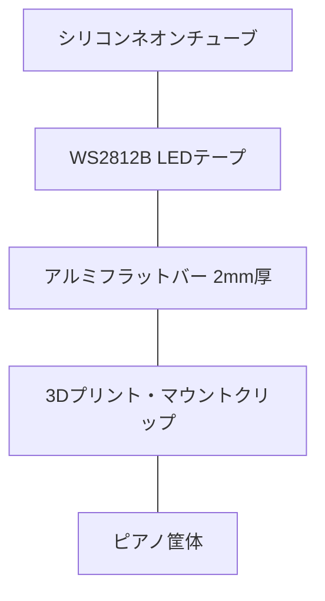

# ピアノ用ハイブリッドLEDレール制作ガイド

このガイドでは、**「アルミフラットバー + シリコンチューブ + 3Dプリントパーツ」** を組み合わせた、剛性と見た目を両立するハイブリッドレールの作り方を解説します。

> [!NOTE]
> **独自アレンジについて**
> 公式プロジェクトではLEDテープの固定方法について厳密な指定はありませんが、本プロジェクトでは、144LED/mテープの熱対策と見た目の美しさ（ネオン管風）を両立するため、このハイブリッドレール構成を**独自のアプローチ**として提案しています。

## 構成図 (断面イメージ)

## 必要な材料

- **アルミフラットバー**: 2mm厚 × 20mm幅 (1m物を2本)
- **シリコンスリーブ**: 10mm幅LED用 (T1023等) 2m分
  - **白 (乳白) [採用]**: **明るさ最大 (透過率70-85%)**。昼間のリビングでも鮮明に視認可能。
  - **黒 (スモーク)**: 見た目重視。ピアノと同化する「ステルス」仕様。144LED/mなら十分な光量を確保可能だが、明るさでは白に劣る。
- **LEDテープ**: WS2812B 144LED/m
- **放熱用両面テープ**: LEDの熱をアルミ板へ逃がすために使用。
- **3Dプリントパーツ**: PLAまたはPETG製マウント

## 制作ステップ

### 1. アルミ板の計測と切断

1. ピアノの鍵盤幅（88鍵なら約123cm）を測ります。
2. アルミ板1枚目（100cm）と、2枚目から必要な長さ（約23cm）を切り出します。
3. **金切鋸** で切断し、切断面を金属ヤスリで滑らかにします。

### 2. LEDの挿入と貼り付け

1. LEDテープをシリコンチューブの中に通します。セットに付属の「引き込み用ワイヤー」を使うとスムーズです。
2. **放熱対策**: シリコンは断熱材でもあるため、LEDの熱がこもりやすくなります。
   - チューブの底（LEDの裏側）をアルミ板に密着させることが重要です。
   - **放熱用両面テープ** を使用して、LEDテープの熱をシリコン越し、あるいは直接アルミ板へ伝えるように工夫してください。
3. チューブの底面に両面テープがある場合は、それをアルミ板の中心に貼り付けます。
   - ※放熱を最大限高めるなら、チューブ自体の厚みが薄い「ネオンタイプ」を選んでください。

### 3. マウントパーツの3Dプリント

1. **Bambu Lab P2S** を使用して、以下のパーツを印刷します。
   - **センタージョイント**: 2枚のアルミ板を裏側から連結し、剛性を出すパーツ。
   - **ピアノ固定クリップ**: ピアノの鍵盤蓋の隙間や背面レールに引っ掛けるためのパーツ。
   - **エンドキャップ**: レールの両端を保護し、配線を逃がすキャップ。

### 4. 組み立てと設置

1. ジョイントパーツを使ってアルミ板を一直線に繋ぎます。
2. LED入りのシリコンチューブを固定します。
3. ピアノに設置し、配線をラズパイ（HAT基板）へ接続します。

## メリット

- **放熱性**: LEDの熱がアルミ板全体に広がるため、LEDの寿命が延びます。
- **美観**: カバー無しのLED剥き出しに比べ、ネオン管のような高級感のある光り方になります。
- **剛性**: 1.2mの距離でも「たわみ」が発生せず、鍵盤に対して常に水平を保てます。
