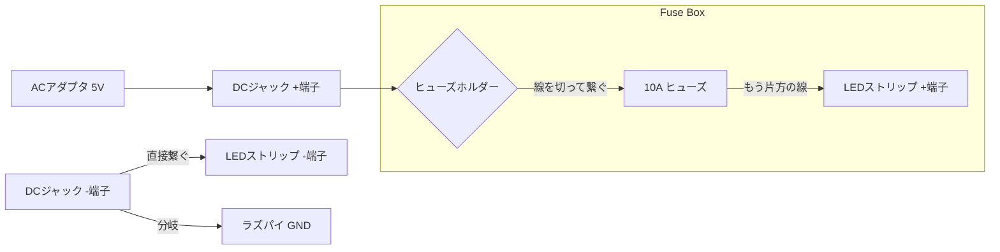

# 安全のための「ヒューズ」講座 ⛑️

電子工作、特に10A近い大電流を扱うこのプロジェクトでは、ヒューズは「命綱」です。
物理的にどう繋ぐのか、なぜ必要なのかを解説します。

## 1. なぜヒューズが必要？

ACアダプタ（5V 6.2A）は非常にパワフルです。もし配線を間違えてプラス(+)とマイナス(-)が直接触れてしまう（ショートする）と、一瞬でケーブルが熱を持ち、最悪の場合は煙が出たり発火したりします。

ヒューズを挟んでおくと、**異常な電流が流れた瞬間に中の金属が溶けて回路を遮断**してくれます。ACアダプタやラズパイ、そして家（ピアノ）を守るための装置です。

## 2. 物理的な接続イメージ

秋月電子などで売っている「コード付ヒューズホルダー」は、最初は赤い線が「輪（ループ）」になっています。これを真ん中で切って、回路の途中に割り込ませます。

### 接続の図解 (Mermaid)

### 実際の作業手順

1.  **ホルダーの線を切る**: 輪っかになっている赤い線をニッパーで半分に切ります。
2.  **皮を剥く**: 切った両端の被覆を5mmほど剥きます。
3.  **片方を端子へ**: 片方をDCジャックの「+端子」にネジ留め（またははんだ付け）します。
4.  **もう片方をLEDへ**: もう片方をLEDストリップの「+5V線（18AWG）」にはんだ付けして、熱収縮チューブで保護します。
5.  **ヒューズを挿す**: 最後に、ホルダーの蓋を開けて10Aの平型ヒューズをグッと差し込めば完了です！

## 3. 必要なパーツおさらい

| パーツ | 画像イメージ | 役割 |
| :--- | :--- | :--- |
| **ヒューズホルダー** | [P-11448](https://akizukidenshi.com/catalog/g/g11448/) | ヒューズを保持し、電線に割り込ませるための台座。 |
| **平型ヒューズ (10A)** | [P-10490](https://akizukidenshi.com/catalog/g/g104900/) | 異常時に身代わりに切れてくれる金属片。オレンジ色が10Aの目印です。 |

> [!IMPORTANT]
> **ヒューズは「ACアダプタ（電源）に近い側」に入れる**のが鉄則です。
> そうすることで、その先の回路全体を保護できます。
