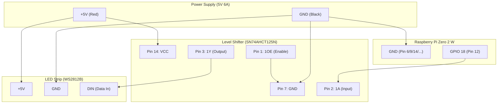
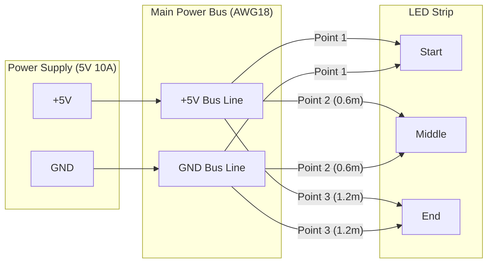

# 配線ガイド (Wiring Guide)

## 物理配線イメージ

以下は、Raspberry Pi、レベルシフター、LEDテープ、電源の物理的な接続イメージです。

## 1. 全体配線図

> [!NOTE]
> **独自アレンジについて**
> オリジナルプロジェクト（onlaj版）の回路図をベースにしつつ、本ドキュメント群の推奨である「横並び構成」と保護機構（ヒューズ・コンデンサ）、およびオプションの「Power Injection（電力注入）」を盛り込んだ**独自の完全版配線図**です。

このドキュメントでは、Raspberry Pi、LEDテープ、およびレベルシフター（74AHCT125）の接続方法を解説します。

レベルシフターを使用することで、ラズパイの3.3V信号を安全かつ確実に5Vに変換し、LEDのチラつきや誤動作を防ぎます。

## 2. 74AHCT125N のピンアサイン詳細

使用するのは14ピンのうち以下の5ピンのみです。

| ピン番号 | 名称    | 接続先               | 備考                                        |
| :------- | :------ | :------------------- | :------------------------------------------ |
| **1**    | **1OE** | **GND**              | 出力を有効にするために常にGNDへ落とします。 |
| **2**    | **1A**  | **ラズパイ GPIO 18** | ラズパイからの3.3Vデータ信号。              |
| **3**    | **1Y**  | **LEDテープ DIN**    | 5Vに増幅されたデータ信号。                  |
| **7**    | **GND** | **共通GND**          | 電源・ラズパイのマイナス線と共通。          |
| **14**   | **VCC** | **5V電源 (+)**       | 5V電源のプラス線から給電。                  |

> [!IMPORTANT]
> **ラズパイの5Vピン（Pin 2/4）からLEDの電力を取らないでください。**
> ラズパイの基板が焼ける恐れがあります。LED用の大電流は必ずACアダプタから直接（またはDCジャック経由で）LEDテープに供給してください。ラズパイとレベルシフターの電源も同じACアダプタから取ります。

## 4. オプション構成：Power Injection (電力注入)

※ オリジナルプロジェクト同様、Web UI の設定で明るさを 50% 以下に抑えることで電圧降下は回避可能であり、本構成は**必須ではありません**。

144LED/mなどの高密度テープを100%の明るさでフルに活用したい場合、末端での色の変色（赤っぽくなる現象）を防ぐ「Power Injection（複数箇所からの給電）」というハードウェアのアップグレードを推奨します。

### 注入のポイント

- **パワーバス**: ACアダプタから直接出ている太い線（18AWG推奨）をテープと並走させます。
- **注入箇所**: 1.2mのテープであれば、「最初・中間・最後」の3箇所（約60cmごと）に給電すると完璧です。
- **データ線**: データ線（DIN）は注入する必要はありません。最初の一箇所のみに接続します。

---

## 5. 推奨される実装方法

- **ユニバーサル基板 (HATスタイル)**:
  - 「Raspberry Pi ZERO用ユニバーサル基板」を使用し、ラズパイの40ピンヘッダーに2x20のピンソケット（またはヘッダー）を介して直接重ねる「HAT形式」での実装を推奨します。
  - レベルシフターやコンデンサはこの基板上に配置し、はんだ付けで固定します。
- **配置**:
  - ラズパイのすぐ隣に配置し、ラズパイ〜レベルシフター間の線はなるべく短く（10cm以内推奨）してください。
  - レベルシフター〜LEDテープ間のデータ線は、数メートル程度ならこのICの力で安定して送信できます。

---

[部品リスト (bom.md) に戻る](file:///Users/mono/Git/electronics/piano-led-visualizer/hardware/bom.md)
