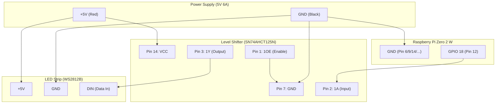

# 配線ガイド (Wiring Guide)

このドキュメントでは、Raspberry Pi、LEDテープ、およびレベルシフター（74AHCT125）の接続方法を解説します。

## 1. 全体配線図

レベルシフターを使用することで、ラズパイの3.3V信号を安全かつ確実に5Vに変換し、LEDのチラつきや誤動作を防ぎます。

## 2. 74AHCT125N のピンアサイン詳細

使用するのは14ピンのうち以下の5ピンのみです。

| ピン番号 | 名称 | 接続先 | 備考 |
| :--- | :--- | :--- | :--- |
| **1** | **1OE** | **GND** | 出力を有効にするために常にGNDへ落とします。 |
| **2** | **1A** | **ラズパイ GPIO 18** | ラズパイからの3.3Vデータ信号。 |
| **3** | **1Y** | **LEDテープ DIN** | 5Vに増幅されたデータ信号。 |
| **7** | **GND** | **共通GND** | 電源・ラズパイのマイナス線と共通。 |
| **14** | **VCC** | **5V電源 (+)** | 5V電源のプラス線から給電。 |

> [!IMPORTANT]
> **ラズパイの5Vピン（Pin 2/4）からLEDの電力を取らないでください。**
> ラズパイの基板が焼ける恐れがあります。LED用の大電流は必ずACアダプタから直接（またはDCジャック経由で）LEDテープに供給してください。ラズパイとレベルシフターの電源も同じACアダプタから取ります。

## 3. 推奨される実装方法

- **ユニバーサル基板 / ブレッドボード**:
  - ラズパイのWHモデル（ヘッダー付き）からメス-メスのジャンパ線や、自作のハーネスで基板へ接続します。
- **配置**:
  - ラズパイのすぐ隣に配置し、ラズパイ〜レベルシフター間の線はなるべく短く（10cm以内推奨）してください。
  - レベルシフター〜LEDテープ間のデータ線は、数メートル程度ならこのICの力で安定して送信できます。

---
[部品リスト (bom.md) に戻る](file:///Users/mono/Git/electronics/piano-led-visualizer/hardware/bom.md)
