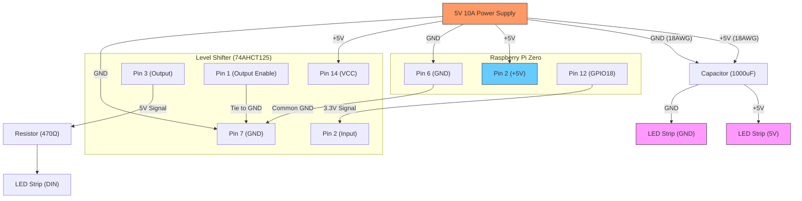

# 配線図とハードウェア構築ガイド

このドキュメントでは、Raspberry Pi、LEDストリップ、レベルシフタ（74AHCT125）、および電源の接続方法について詳しく解説します。

## 1. 全体配線図 (Wiring Diagram)

## 2. 各コンポーネントの役割と接続詳細

### 電源 (Power Supply)

- **容量**: 5V 10A を推奨します。144LEDs/m を鍵盤幅（約1.2m）に使用すると約172個のLEDになります。
  - 全点灯（白/最大輝度）時：172個 × 60mA = **10.32A**
  - 通常の演奏（50%輝度・数音同時）であれば 3〜5A 程度で足りますが、余裕を持つことが重要です。
- **配線**: 電流が大きいため、電源からLEDストリップの根元までは太い電線（**18AWG**）を使用してください。

### レベルシフタ (74AHCT125)

- **必要性**: ラズパイの信号は 3.3V ですが、WS2812B は 5V 信号を期待しています。3.3V でも動作することがありますが、ノイズに弱くチラつきの原因になるため、レベルシフタで 5V に変換するのが正攻法です。
- **74AHCT125のピン配置**:
  - `Pin 1 (1/OE)`: GNDに接続（出力を有効化）
  - `Pin 2 (1A)`: ラズパイの GPIO 18 (Pin 12) から入力
  - `Pin 3 (1Y)`: LED の DIN へ出力（抵抗を挟む）
  - `Pin 7 (GND)`: GNDへ
  - `Pin 14 (VCC)`: 5V電源へ

### 電解コンデンサ (1000μF) と 抵抗 (470Ω)

- **コンデンサ**: 電源の急激な変化（突入電流）からLEDを保護します。LEDストリップに近い位置で + と - の間に並列に接続します。
- **抵抗**: データラインに直列に挿入し、信号の反射（ノイズ）を抑えます。レベルシフタの出力からLEDの DIN の間に配置します。

## 3. 構築前のチェックリスト (Pre-flight Checklist)

> [!IMPORTANT]
> **共通のGND (Common Ground)**
> Raspberry Pi の GND、電源の GND、LED の GND はすべて電気的に繋がっている必要があります。これが行われていないと信号が不安定になり、LEDが正しく点灯しません。

> [!WARNING]
> **LEDの向き (Data Direction)**
> LEDストリップには信号の流れる向き（矢印 `→`）があります。必ず `DIN` (Data In) 側から信号を入力してください。`DOUT` (Data Out) に繋いでも反応しません。

- [ ] **電源電圧の確認**: 必ず「5V」であることをテスターで確認してから接続してください。12Vなどを繋ぐと一瞬で全パーツが破損します。
- [ ] **逆接防止**: 5V と GND を逆に繋がないよう、配線色（赤：5V、黒：GND）を徹底してください。
- [ ] **はんだ付けの強度**: 大電流が流れる場所は、芋はんだにならないようしっかりと加熱して接合してください。
- [ ] **絶縁処理**: 熱収縮チューブを使用して、ショート（短絡）しないように露出部を保護してください。
- [ ] **電力注入 (Power Injection)**: もしLEDの末端が暗くなったり色が変わったりする場合は、ストリップの最後（または中間）にも電源線を並列に接続してください。1.2m程度なら通常は片側給電で十分です。

---

この構成により、ノイズに強く、安定した鮮やかなピアノビジュアライザーが実現します。
🛠️ 安全第一で作業を進めましょう！
