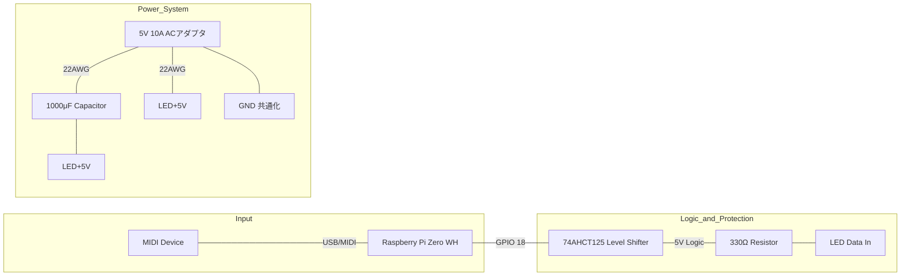

# 配線設計・技術解説 (Wiring Design & Technicals)

電子工作における安全かつ安定した動作のための、詳細な配線ガイドと技術的背景です。

## 1. 配線構成 (Topology)

## 2. 技術的詳細の解説

### 2.1 信号品質 (Signal Integrity)

WS2812Bは**高速シリアルプロトコル（800kHz）**を使用します。このため、信号の「なまり」や「反射」が誤動作の原因になります。

- **直列抵抗 (330Ω)**: 信号線のインピーダンスを整合させ、オーバーシュートやアンダーシュート（波形の乱れ）を抑制します。LEDテープの最初のLEDの直前に配置してください。
- **レベルシフタの実装**: Raspberry Piの3.3V信号は、5V動作のLEDにとって「HIGHかLOWか判断に迷う」ボーダーライン上にあります。レベルシフタ（74AHCT125など）で5Vに引き上げることで、確実な通信を実現します。

### 2.2 電源管理と安全性 (Power Management)

フルカラーLEDは1個あたり最大 **60mA (白・最大輝度時)** 消費します。

- **計算例**: 144個 × 60mA ＝ **8.64A**
- **配線の太さ**: 一般的なジャンパーワイヤーは非常に細く、数アンペア流れると発熱・損焼の恐れがあります。電源供給ラインには **22AWG〜18AWG程度** の太めのケーブルを使用してください。
- **共通GND**: ラズパイ、LED、外部電源のGNDがすべて繋がっていることを確認してください。電位差があるとデータが正しく伝わりません。

### 2.3 熱対策

高密度なLEDテープは長時間点灯させると熱を持ちます。

- **固定**: 3Dプリントしたマウントとピアノの間に少し隙間を空けるか、熱伝導の良いアルミレール等を使用すると長持ちします。
