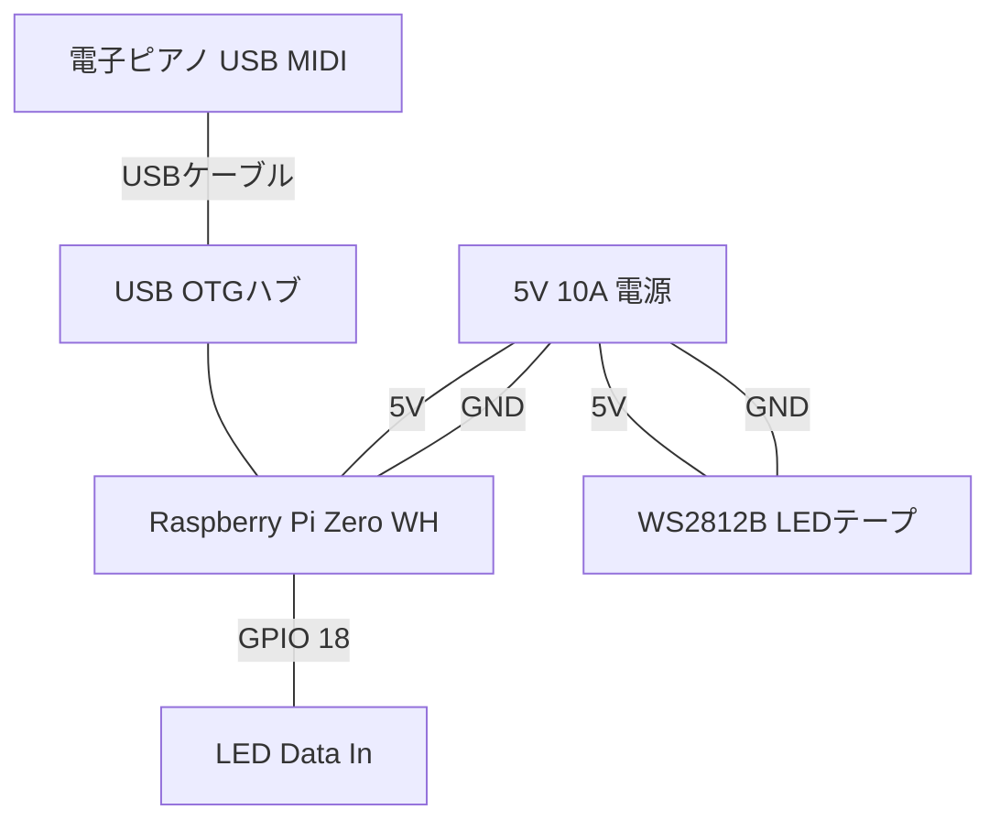

# 配線図 (Wiring Diagram) - Piano LED Visualizer

[onlaj/Piano-LED-Visualizer](https://github.com/onlaj/Piano-LED-Visualizer) の基本構成に基づいた配線ガイドです。

## 1. 全体接続イメージ

## 2. ピンアサインの詳細

| Raspberry Pi Pin     | LED Strip | 備考                                                         |
| :------------------- | :-------- | :----------------------------------------------------------- |
| **5V (Pin 2/4)**     | 5V        | ACアダプタから直接給電する場合は接続不要（共通電源なら接続） |
| **GND (Pin 6等)**    | GND       | 必ずGNDを共通にする必要があります                            |
| **GPIO 18 (Pin 12)** | Data In   | `rpi-ws281x` ライブラリのデフォルトです                      |

## 3. 重要な注意点

### レベルシフタ (Level Shifter) の使用

Raspberry Pi の GPIO は **3.3V** 出力ですが、WS2812B は通常 **5V** ロジックです。

- **直結**: 動作する場合も多いですが、信号が不安定になりノイズ（チラつき）が発生することがあります。
- **推奨**: 74AHCT125 などのレベルシフタを使用して 5V に変換すると確実です。

### 電源供給

- 88鍵ピアノの場合、LEDの数は約144〜170個程度になります。
- 全点灯時に最大 10A 近く流れる可能性があるため、配線は太めのもの（22AWG以上）を使用し、電源の入力端子もしっかりしたものを選んでください。

### 接地 (Common Ground)

- Raspberry Pi と LED テープの GND は必ず接続して、電位を共通にしてください。
